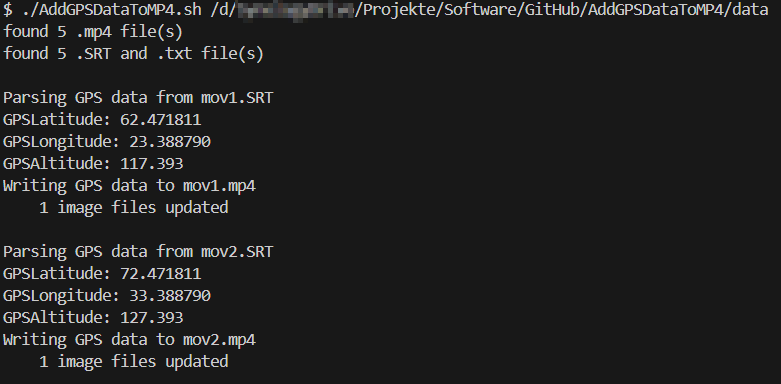

# AddGPSDataToMP4

## Description

This script reads GPS data from a .txt or .SRV file and copies it to the metadata of the corresponding .mp4 file. Please make sure to save the video and the data file in the same directory. Both must have the same name!

Convention: 
   - /path/to/your/videos/nameOfVideo.mp4
   - /path/to/your/videos/nameOfVideo.txt
   - The GPS data has to be saved as the following pattern:
   ```bash
   [latitude: 62.471811] [longitude: 23.388790] [rel_alt: 0.000 abs_alt: 117.393]
   ```


## Installation

1. Download ExifTool (v12.97) and move it to your PATH, as described in the installation guide on the homepage of Exiftool:
   - [ExifTool installation guide](https://exiftool.org/install.html)
   - [exiftool-12.97_64.zip](https://exiftool.org/exiftool-12.97_64.zip)
   
2. Clone the repository:
   ```bash
   git clone https://github.com/Yoschi95/AddGPSDataToMP4.git
   ```

3. Navigate to the source directory of the repository:
   ```bash
   cd AddGPSDataToMP4/src
   ```

## Usage

1. Call the script:
   ```bash
   ./AddGPSDataToMP4.sh /path/to/your/videos
   ```

## Example



## Contributing

Contributions are welcome! Please open an [Issue](https://github.com/Yoschi95/AddGPSDataToMP4/issues) or submit a Pull Request.

## License

This project is licensed under the MIT License. See the [LICENSE](LICENSE) file for details.

## Credits

- [ExifTool](https://exiftool.org/) - A platform-independent Perl library plus a command-line application for reading, writing and editing meta information.